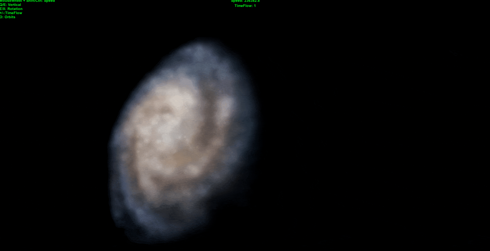
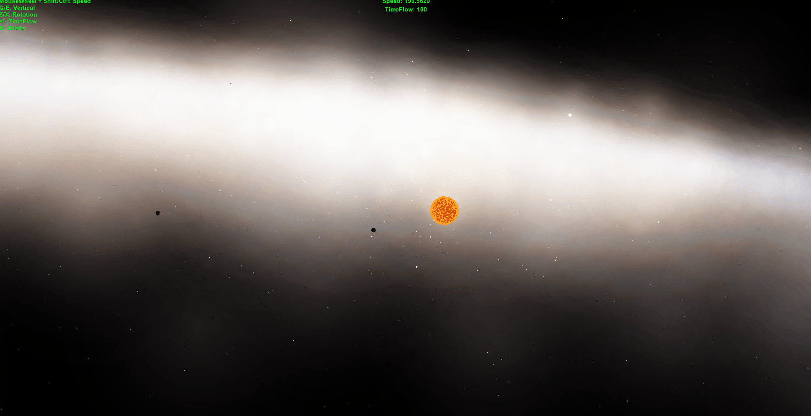
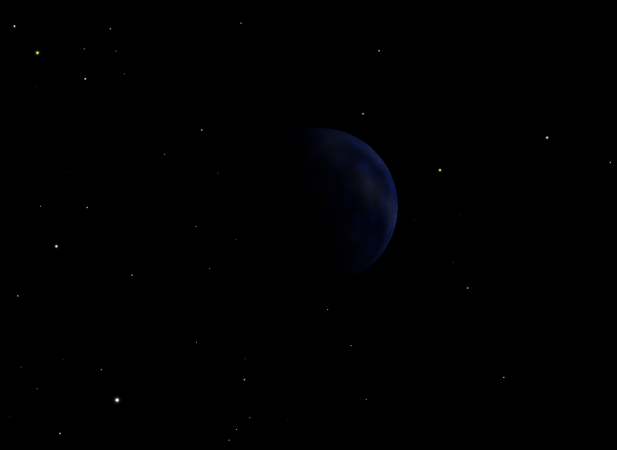

# ProceduralGalaxy

> Procedural galaxy generation with planets and stars, inspired by Space Engine.

> Fly through the galaxy.

## :dizzy: Systems

> Planets orbit around stars using pre-calculated pseudorandom fixed orbit.

## :earth_americas: Planet

> Random planet shot.

## :clipboard: Meta

Spartak Gevorgyan – artak10t@gmail.com

Distributed under the GNU General Public License v3.0 license. See ``GNU General Public License v3.0`` for more information.

[https://github.com/artak10t/github-link](https://github.com/artak10t/)
